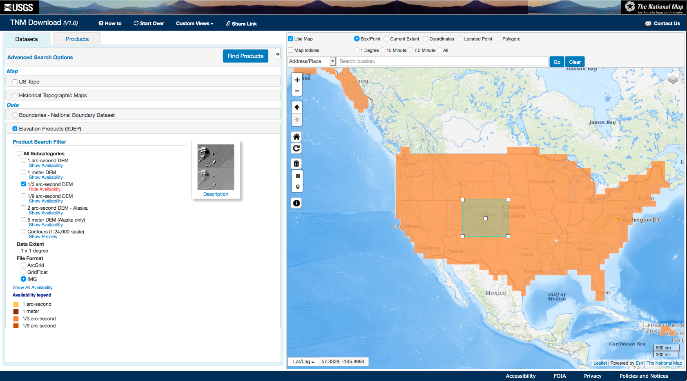
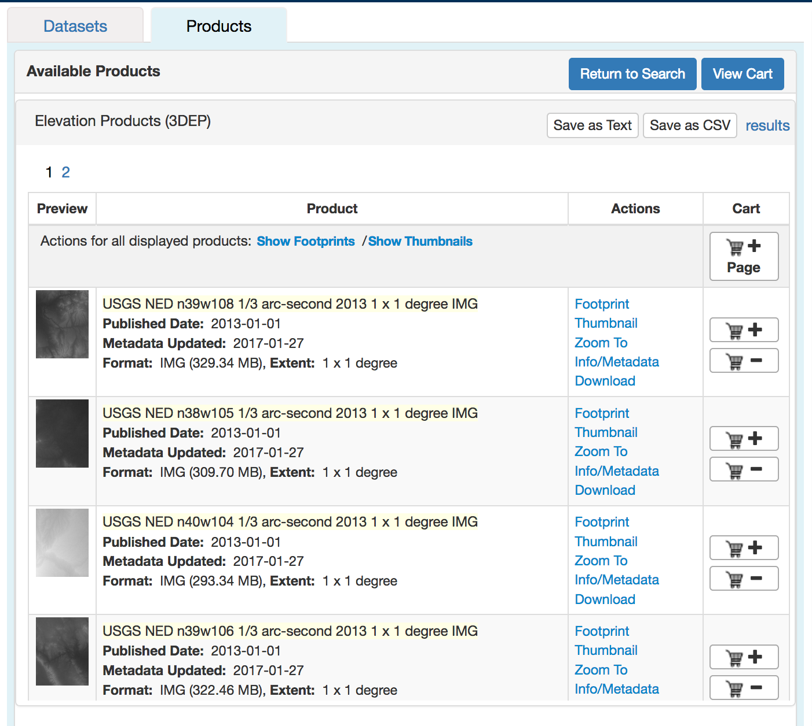
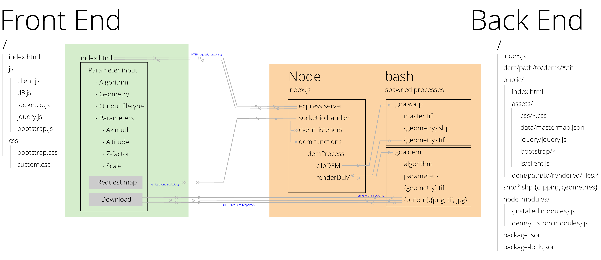
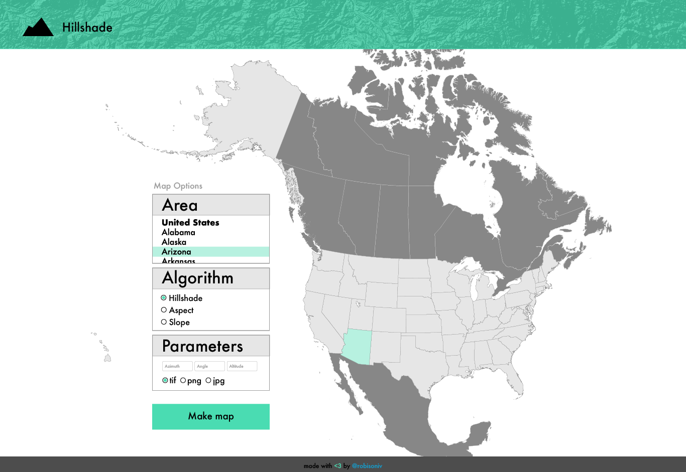

# A DEM Web Application

(Instructions to try to get the app running [here](../) ...)
# Introduction

DEM data and contained information have a wide range of applications for civil planning, agriculture (Abd Aziz 2008), military, land use (Riaño 2003), disaster planning and response (Jaboyedoff 2009, Tralli 2005), and outdoor recreation (Fredston 2000) professionals.

## Research Problem

We lack a simple web UI to customize and generate images based on digital elevation model (DEM) raster data.

Performing such analyses on a PC is constrained by large files corresponding computationally-intensive processes with technical software.

Can we create a functional prototype of a graphical web interface that enables users to select geometry, specify parameters and download the output of a hillshade analysis of DEM data, effectively outsourcing data- and computational-intensive aspects to a cloud server?

## Background

Tools exist that provide the public a way to view hillshade, slope and aspect layers on a map, foremost [caltopo.com](https://caltopo.com) (Jacobs 2018), which offers many features, but is slow and limited in geographic extent. Other tools include the German-language [OpenSlopeMap](https://www.openslopemap.org/) (OpenSlopeMap 2018) and [FloodMap](http://www.floodmap.net/) (Flood Map 2018), but intuitive web tools for non-technical users to generate images from DEM data are lacking. Here we explore the capabilities of GDAL (GDAL/OGR Contributors 2018), NodeJS (Node.js Foundation 2018), D3.js (Bostock 2018), jQuery (JS Foundation 2018), Bootstrap (Otto 2018) and socket.io to "assist people in moving from raw data to knowledge" (Basiri & Dennett, 2018).

# Product

## Requirements

We aim to create a minimum viable product (MVP) of a web app that will:

* serve a webpage depicting the area serviced, where a user can
* select geometry
* define parameters, then
* request and download the resulting processed output image.

Importantly, this system should handle varying geographic extents and scales. We'd like to simply and intuitively generate images derived from DEM rasters for any geometry on Earth or, for that matter, other bodies with DEM data available, such as the moon (Barker 2016).

For this project we created a functional prototype; handling the breadth of corner cases that may arise and production deployment were beyond the scope of the assignment.

#### System Specifications

| Technology | Version |
| --- | --- |
| MacBook Pro | 15-inch, 2018 |
| macOS High Sierra | v10.13.6 64-bit |
| nodeJS (Node.js Foundation 2018) | v8.12.0 |
| Firefox Quantum (Mozilla 2018) | 64.0 |
| Google Chrome (Google Developers 2018) | 71.0.3578.98 |
| Atom (Atom 2018) | 1.33.1 |
| Python (van Rossum 1995) | 3.6.7 |

## Data

DEM data is captured using synthetic aperture radar technology to detect the elevations of points on a surface. Put simply, light travels at a constant rate; by recording time elapsed between the emission of a pulse of electromagnetic radiation from a sensor-mounted two-antenna array and the detection of its reflection from a surface, the distance of the reflected surface from the sensor can be determined for each point (Lu 2012).

Much DEM data of the Earth's surface is available online, for free. The US Geological Survey's (USGS) online [Earth Explorer tool](https://earthexplorer.usgs.gov/) (USGS 2018) offers access to various DEM datasets.

While DigitalGlobe (DigitalGlobe 2019) and Harris Geospatial (Harris Geospatial 2019)) offer high resolution DEM data commercially, we chose free options while designing a system that could incorporate alternative input datasets.

### Sourcing

The USGS 3D Elevation Program dataset includes 1/3 arc-second data for all US territory, the highest resolution DEM imagery available for our entire service area (USGS 2018, Gesch 2002).

### Collection

A simple bounding box tool on the [National Map interface](https://viewer.nationalmap.gov/basic/) provided a CSV including URLs resolving to a zipped folder containing `.img` files of each relevant tile.

#### USGS National Map 1/3 Arc Second DEM Download Interface (`.img` format)





The website describes a process to batch download the files ... on a Windows machine. We adapted a [shell script](./code/download/README.md) from [sepans on github](https://gist.github.com/sepans/b493a0b9d3027310e9f2) (sepans 2015) to create a programmatic way to download a set of 1/3 arc-second resolution raster tiles based on the CSV of URLs from the USGS and create a single merged raster.

#### `dl-zips.sh`

```bash
#!/bin/sh

# adapted from https://gist.github.com/sepans/b493a0b9d3027310e9f2
# Must include the path to a csv file downloaded from USGS National Map
# as the parameter

num=1
csv=$1
urls=($(python './get-urls.py' $csv | tr -d '[],')) # get-urls.py below

for (( i = 0; i < ${#urls[@]}; ++i )); do
  filename="../../data/dls/colorado/ned-$num.zip"
  cmd="curl -s -o $filename  ${urls[i]}"
  eval $cmd
  num=$((num+1))
done

# (Note: The above shell script works, but could be improved to better
# handle disruptions in data, validate checksums if provided, etc.)
```

#### `get-urls.py`

```python
#!usr/bin/python
import sys
import pandas as pd # (McKinney 2018)

def getURLs(file_csv):
    df = pd.read_csv(file_csv)
    print(str( df['downloadURL'].tolist()[0:5])) # Print rather than return, for the shell script
    # Note the governor - only downloading 0:5 for testing purposes. Removing "[0:5]" would
    # prompt download of the entire area of interest.

# The following line allows invocation from the command line, with the first
# argument after invocation being passed in as the file_csv parameter
if __name__ == '__main__':
    getURLs(sys.argv[1])
```

### Preparation

Once collected, python's `os` and `zipfile` standard libraries enabled us to unzip and extract files (python.org 2018); `os` and `gdal_merge.py` allowed us to merge multiple rasters. While our process is unnecessarily data intensive, we found the workflow simpler and safer - future iterations of the app will delete duplicitous data.

#### `unzip.py`

```python
#!usr/bin/python

# To unzip files downloaded with ../download/dl-zips.sh
import os
import sys
import zipfile

def unzip(dir_of_zips):
    if dir_of_zips[-1] != '/':
        dir_of_zips += '/'

    for f in os.listdir(dir_of_zips):
        if '.zip' in f:
            target_zip = dir_of_zips + f
            target_dir = dir_of_zips + f.replace('.zip', '')

            try:
                with zipfile.ZipFile(target_zip, 'r') as z:
                    z.extractall(target_dir)
            except:
                print(target_zip, 'failed to unzip')


if __name__ == '__main__':
    unzip(sys.argv[1])
```

To ease invocation of the `merge.py` function, we aggregated all `.img` files from their respective folders.

#### `aggregate.py`

```python
#!usr/bin/python
import os
import sys
import shutil

def aggregate(dir_of_unzipped_dirs):

    if dir_of_unzipped_dirs[-1] != '/':
        dir_of_unzipped_dirs += '/'

    aggregate_path = dir_of_unzipped_dirs + 'aggregated/'

    try:
        os.mkdir(aggregate_path)
    except:
        print('Adding to existing "aggregated" directory')

    for dir in os.listdir(dir_of_unzipped_dirs):
        if dir is not 'aggregated':
            if '.zip' not in dir:
                for file in os.listdir(dir_of_unzipped_dirs + dir):
                    if '.img' in file:
                        origin = dir_of_unzipped_dirs + dir + '/' + file
                        shutil.copy(origin, aggregate_path + file)


if __name__ == '__main__':
    aggregate(sys.argv[1])
```

Finally we merge all of the raster tiles into one "master raster", a DEM dataset which we could pass into clipping or DEM analysis algorithms. `merge.py` invoked a terminal prompt, calling `gdal_merge.py` (GDAL/OGR contributors 2018) using `os.system()`:

#### `merge.py`

```python
#!usr/bin/python
import os
import sys

def merge_rasters(dir):
    if dir[-1] != '/':
        dir += '/'

    files_to_merge = ''
    for file in os.listdir(dir):
        if '.img' in file:
            files_to_merge += dir + file + ' '

    os.mkdir(dir + 'merged')
    cmd = 'gdal_merge.py -of GTiff -o ' + dir + 'merged/merged_raster.tif ' + files_to_merge

    os.system(cmd)

if __name__ == '__main__':
    merge_rasters(sys.argv[1])
```

## The App

Data prepared, we get into the heart of the app: a web page, a NodeJS program running on a server processing HTTP requests and requests for processed imagery, and a (flat) data storage system.

#### App Model



### Interface

#### Wireframing

Next, we created the visual layout of the interface in Adobe Illustrator using vectors from freevectormaps.com (Grajeda 2018). Wireframing makes coding more efficient - tweaking minor visual elements is much easier in Illustrator than in Atom with Firefox.



(We initially designed for all of North America, then constrained our service area to Colorado for functional implementation.)

#### UI Design

Visual layout complete, our next step was to code the front end web page. Bootstrap provides an excellent framework for responsive web pages (getbootstrap.com, 2018). Based on a bare Bootstrap template from [BlackrockDigital on github](https://github.com/BlackrockDigital/startbootstrap-bare) (BlackrockDigital 2018), we built the form input component per the wireframes.

To serve as additional visual feedback in our user interface, we also implemented a map of our service area using D3.js (Bostock 2018).

This required a fair bit of data preparation, including:

| Process | Data | Tool Used / Source |
| --- | --- | --- |
| Download `.shp` files | Country, state and county boundaries | naturalearthdata.com (Patterson 2018), Colorado Department of Public Health and Environment (2018) |
| Merge geometries | Country, state and county `.shp` files | QGIS (QGIS Development Team 2018), MMQGIS plugin (Minn 2018) |
| Simplify merged output | Merged `.json`, from QGIS | mapshaper.org (Bloch 2018), Visvalingam / weighted area algorithm (Visvalingam 2001) |

As a web app, reducing data loads is important for performance. Further data efficiency could be won with the topojson file specification and corresponding javascript library with no loss of information (Bostock 2016), but we deemed that beyond the requirement of an MVP.

The geometry selection input and the map offer two ways to select the target geometry, and required the assignment of corresponding identifiers in each pair of elements so we could attach event handlers and provide feedback to the user, highlighting both the row and the spatial geometry. A snazzy little jQuery scroller provided by [lepe on StackOverflow](https://stackoverflow.com/questions/2346011/how-do-i-scroll-to-an-element-within-an-overflowed-div) made feedback even smoother and more intuitive (Stack Overflow, 2018).

### NodeJS Server

The final logic to implement for a functional app: a NodeJS server. This logic relies on a blend of standard, installed and custom-written Node modules. `/index.js` served as our Node app entry point.

#### `express`

Express provides robust tools for handling web requests (expressjs.com 2018). Our implementation included a parser for incoming HTTP requests (i.e. for `index.html`) and middleware specifying the path to the public folder from which to serve files, including webpage dependencies and rendered image files.

```javascript
// express-relevant lines from index.js
const express = require('express')
const app = express();
const path = require('path');
const server = require('http').createServer(app);

// Configure port to listen on
let port = process.env.PORT;
if (port == null || port == "") {
  port = 8000;
}

server.listen(port)

// to handle HTTP requests from the client
app.get('/', (req, res) => {
  res.sendFile(path.join(__dirname + '/public/index.html'));
});

// To route requests for other files to /public directory
app.use(express.static('public'));

// Here we could easily add logic to provide a URL-based imagery API
```

#### `socket.io`

`socket.io.js` enables the establishment of a websocket connection between a browser and server (socket.io 2018). Within both `index.js` and `client.js` we create two instances of the `Socket` object, assigned to the `io` variable in each context; handlers attached to these objects process events: the `.on()` method to receive data, the `.emit()` method to transmit it.

### User Workflow

First, a `socket.io` connection is established:

#### Within `client.js`

```javascript
// Client-side logic: Phase 1
// socket.io.js loaded within <script> tag,
var socket = io.connect("/");

socket.on("connect", function(){
    console.log("Browser connected!");
    // ^^ in browser's console
});

$('#generate-dem-request').click(function() {

  // Code removed to validate demParams and
  // update the interface state to reflect
  // submission of request to process data

  // then,
  socket.emit("getDEM", demParams);
  // transmits the demParams JSON to the server ....
});
```

#### Within `index.js`

```javascript
// Server-side logic: Phase 2
// called within index.js, though
// some code is written in custom
// modules in /node_modules/dem/*.js

// socket.io configuration - index.js (server-side)
const io = require('socket.io')(server);
  // `server` from the express app and http server created prior

io.on('connection', (socket) => {

  socket.on('getDEM', (demParamsFromClient) => {
    // This receives the getDEM transmission emitted from
    // the client, with corresponding JSON: demParams.

    // This function is explained below - note we pass the
    // created instance of eventEmitter into the function so
    // we have access to those listeners set in index.js from
    // within the demProcess function body.
    demProcess(demParamsFromClient, eventEmitter);
  });

  // Server-side processing takes place here - renderProcess is a
  // spawned process generating the output image.
  renderProcess.on('close', (code) => {
    if (code == 0) {      // Upon successful processing,
      // ... the event is emitted ...
      eventEmitter.emit('dem-success', outputpath.substr(9));
    }
  });

  // ... that is detected by a listener with access to the server-side
  // instance of socket, which can emit an event to the client, here:
  eventEmitter.addListener('dem-success', (pathToRenderedFile) => {
    socket.emit('dem-success', pathToRenderedFile); // sent to client
  });
});
```

#### Back to `client.js`

Successful process completion transmits the path to the output file to our client, via the open websocket connection. A client-side event handler reveals a "Download" button linking to the rendered file.

```javascript
socket.on('dem-success',(refToDEMonServer) => {

  // Update visual state with download component
  // linking to final output file.
  promptDEMdownload(refToDEMonServer);
});
```

#### `demProcess()` and `gdal`

We found spawning child processes from within the Node app provided access to the best-documented (command line) interface with `gdal`, plus allowed for asynchronous processing, addressing our aspirational worries about heavy user loads (unlike `node-gdal`, which is "not async, so it will block node's event loop" (Reavis 2018)). We rejected python's `gdal` bindings due to poor documentation (GDAL/OGR Python API 2018).

A Node app can spawn a child process with the standard `child_process` module, which accepts the prompt, an array of parameters and flags, and options as arguments to its `.spawn()` method (Node.js Foundation 2018). The process can execute code when process events occur, such as `stdout`, `error` and `close`.

#### `gdalwarp`

We identified the need to clip the master DEM raster into smaller irregular polygons for more efficient processing and to eventually accept custom polygons from users. The `gdalwarp` command prompt, passed a raster to be clipped and a file describing the clip area, will output a clipped raster image (GDAL/OGR Contributors 2018).

```javascript
// the gdalwarp logic flow, with _params containing parameters received from the client:

  var demPath = './dem/gen/state/colorado/' + _params.area+ '/' + _params.area + '.tif',
    clipArgs = ['-of', 'GTiff', '-cutline', './shp/' + area + '.shp', '-crop_to_cutline', '-dstalpha',
      './dem/gen/state/colorado/colorado/colorado.tif', demPath
    ]

  // Spawn the child process
  const clipProcess = spawn('gdalwarp', clipArgs, {env: productionEnv, shell: true})
     .on('error', function (error) {throw error;});

  clipProcess.stdout.on('data', (data) => {
    console.log(data.toString('utf8'));
  })

  clipProcess.on('close', (code) => {
    if (code == 0) {
      // Invoke the next step in the workflow upon successful clip
      renderDEMtoOutput(_params, _eventEmitter);
    }
  })
```

#### `gdaldem hillshade`

With a DEM raster of our target geometry available, the Node app builds and spawns a `gdaldem hillshade` command. This algorithm generates an image that calculates the amount of light striking and reflecting off of each pixel in the image, based on the elevations of surrounding pixels and on the position (altitude and azimuth) of the light source. Factors defining vertical exaggeration and scale can be specified.

```javascript
// Core hillshade render logic, from within renderDEMtoOutput() function
const renderProcess = spawn('gdaldem', demArgs, {env: productionEnv, shell: true})
  .on('error', function (error){throw error;});

renderProcess.stdout.on('data', (data) => {
  console.log(data.toString('utf8'));
});

// This from above, emitting an event that triggers a message sent from
// within the server's socket.io connection with the client.
renderProcess.on('close', (code) => {
  if (code == 0) {
    _eventEmitter.emit('dem-success', outputpath.substr(9));
    // ^^ _eventEmitter instance passed in from index.js
  }
});
```

### File storage

Implementing a full-featured database system proved beyond the scope of our MVP. Instead, we read and write files directly from and to the disk in designated folders in our directory tree. This simple solution entails several drawbacks related to scalability, organization, efficiency and production deployment.

Heroku, for example, utilizes an [ephemeral filesystem](https://devcenter.heroku.com/articles/dynos) and will delete any files regularly, requiring a database (Heroku Dev Center 2018). We have developed with MongoDB (MongoDB 2019) or PostgreSQL (PostgreSQL 2019) in mind; incorporating either would require minor adaptation of existing code and provide robust storage and querying capabilities (including geospatial / topological querying and indexing).

## Scaling and Deployment

Colorado was selected due to its small size and full availability of high resolution DEM imagery, though the system is designed to easily scale.

This will require collection of complete high-resolution DEM datasets and a database management system as described above.

The most difficult aspect to scaling will be the clipping geometries and corresponding front-end geometry selection functionality. Some unique identifier will need to be created for each geometry available to select, thereby enabling expansion and avoiding identifier conflict.

We would also like to generate imagery based on the other `gdaldem` algorithms available - `slope` and `aspect`, among others. This is a relatively low-effort extension of the functionality implemented in this MVP.

Deploying this application to a production web server will require additional configuration. We attempted deployment on the Google App Engine (Google Cloud 2018) and on Heroku - each presented different challenges that led us to focus on the functional prototype for the purposes of this assignment.

GAE does not support websockets without substantial configuration due to security concerns. Heroku's epheremeral filesystem required the inclusion of a database management system, outside the scope of this MVP.

Deployment is the next challenge to tackle.

# Conclusion

Building a prototype hillshade generator web application gave us the opportunity to work with raster and vector geospatial data, and to explore a wide suite of tools for manipulate and analyze these data in different computing contexts - bash, python, javascript, HTML, CSS, with numerous libraries and modules, plus other tools. With a bit more work - testing and production deployment - we could provide these services for the public benefit.

A final note: we'd love to develop this on the web3 stack, using IPFS (Protocol Labs 2018) for a distributed solution, rather than relying on the centralized client-server model employed here.

## Citations

3D Elevation Program. 2019. 3D Elevation Program. [ONLINE] Available at: https://www.usgs.gov/core-science-systems/ngp/3dep. [Accessed 15 December 2018].

Abd Aziz, S., 2008. Development of digital elevation models (DEMs) for agricultural applications.

Atom. 2018. Atom. [ONLINE] Available at: https://atom.io/. [Accessed 04 September 2018].

Barker, M.K., Mazarico, E., Neumann, G.A., Zuber, M.T., Haruyama, J., Smith, D.E., 2016. A new lunar digital elevation model from the Lunar Orbiter Laser Altimeter and SELENE Terrain Camera. Icarus 273, 346–355. https://doi.org/10.1016/j.icarus.2015.07.039

Basiri, Ana, Dennett, Adam. 2018. CASA0005- Geographic Information System and Science Coursework Assessment. UCL Centre for Advanced Spatial Analysis.

Bloch, Matthew. 2018. mapshaper. [ONLINE] Available at: https://mapshaper.org/. [Accessed 10 December 2018].

BlockrockDigital, GitHub. 2019. GitHub - BlackrockDigital/startbootstrap-bare: A bare Bootstrap HTML starter template for rapid development - created by Start Bootstrap. [ONLINE] Available at: https://github.com/BlackrockDigital/startbootstrap-bare. [Accessed 10 December 2018].

Bostock, Mike. 2018. D3.js - Data-Driven Documents. [ONLINE] Available at: https://d3js.org/. [Accessed 10 December 2018].

Colorado Department of Public Health and Environment. 2018. Colorado County Boundaries. [ONLINE] Available at: https://data-cdphe.opendata.arcgis.com/datasets/66c2642209684b90af84afcc559a5a02_5. [Accessed 19 December 2018].

DigitalGlobe. 2019. Elevation Mapping With Satellite Imagery - DigitalGlobe. [ONLINE] Available at: https://www.digitalglobe.com/products/advanced-elevation-series. [Accessed 02 January 2019].

Flood Map: Water Level Elevation Map. 2019. Flood Map: Water Level Elevation Map. [ONLINE] Available at: http://www.floodmap.net/. [Accessed 28 December 2018].

Fredston, J., 2011. Snow Sense: A Guide To Evaluating Snow Avalanche Hazard. Alaska Mountain Safety Center, Inc.

GDAL/OGR contributors. 2018. GDAL/OGR Geospatial Data Abstraction software Library. Open Source Geospatial Foundation. URL http://gdal.org

GDAL/OGR Python API. 2018. GDAL/OGR Python API. [ONLINE] Available at: https://gdal.org/python/. [Accessed 14 December 2018].

Gesch, D., M. Oimoen, S. Greenlee, C. Nelson, M. Struck, and D. Tyler, 2002. The National Elevation dataset, Photogrammetric Engineering & Remote Sensing, 68(1): 5–11.

Google Cloud. 2018. App Engine - Build Scalable Web & Mobile Backends in Any Language  |  App Engine  |  Google Cloud. [ONLINE] Available at: https://cloud.google.com/appengine/. [Accessed 14 December 2018].

Google Developers. 2018. Google Chrome Web Browser. [ONLINE] Available at: https://www.google.com/chrome/. [Accessed 04 September 2018].

Grajeda, Ted. 2018. Free Vector Maps | Royalty-Free Vector Maps. [ONLINE] Available at: https://freevectormaps.com. [Accessed 10 December 2018].

Harris Geospatial. 2019. Digital Elevation Models & Maps - DEM Software - Digital Elevation Data . [ONLINE] Available at: https://www.harrisgeospatial.com/Data-Imagery/Elevation-Data. [Accessed 02 January 2019].

Heroku Dev Center. 2018. Dynos and the Dyno Manager | Heroku Dev Center. [ONLINE] Available at: https://devcenter.heroku.com/articles/dynos. [Accessed 28 December 2018].

Jaboyedoff, M., Couture, R., Locat, P., 2009. Structural analysis of Turtle Mountain (Alberta) using digital elevation model: Toward a progressive failure. Geomorphology, Dating, triggering, modelling, and hazard assessment of large landslides 103, 5–16. https://doi.org/10.1016/j.geomorph.2008.04.012

Jacobs, Matt. 2018. CalTopo - Backcountry Mapping Evolved. [ONLINE] Available at: https://caltopo.com/. [Accessed 10 December 2018].

JS Foundation - js.foundation. 2018. jQuery. [ONLINE] Available at: https://jquery.com/. [Accessed 10 May 2018].

Lu, Z., Jung, H.-S., Zhang, L., Lee, W., Lee, C.-W., Dzurisin, D., 2012. Digital elevation model generation from satellite interferometric synthetic aperture radar, in: Advances in Mapping from Remote Sensor Imagery. CRC Press, pp. 119–144. https://doi.org/10.1201/b13770-6

McKinney, Wes. 2018. Python Data Analysis Library — pandas: Python Data Analysis Library. [ONLINE] Available at: https://pandas.pydata.org/. [Accessed 10 October 2018].

Minn, Michael. 2018. MMQGIS. [ONLINE] Available at: http://michaelminn.com/linux/mmqgis/. [Accessed 18 December 2018].

MongoDB. 2019. Open Source Document Database | MongoDB. [ONLINE] Available at: https://www.mongodb.com/. [Accessed 02 January 2019].

Mozilla. 2018. Internet for people, not profit — Mozilla . [ONLINE] Available at: https://www.mozilla.org. [Accessed 04 September 2018].

Node.js Foundation. 2018. Node.js. [ONLINE] Available at: https://nodejs.org. [Accessed 10 May 2018].

OpenSlopeMap. 2018. OpenSlopeMap - Die Hangneigungskarte. [ONLINE] Available at: https://www.openslopemap.org/. [Accessed 28 December 2018].

Otto, Mark, Thornton, Jacob, and Bootstrap contributors. 2018. Bootstrap · The most popular HTML, CSS, and JS library in the world. [ONLINE] Available at: https://getbootstrap.com/. [Accessed 10 December 2018].

Patterson, Tom and Kelso, Nathaniel Vaughn. 2019. 10m-cultural-vectors | Natural Earth. [ONLINE] Available at: https://www.naturalearthdata.com/downloads/10m-cultural-vectors/. [Accessed 10 December 2018].

PostgreSQL. 2019. PostgreSQL: The world's most advanced open source database. [ONLINE] Available at: https://www.postgresql.org/. [Accessed 02 January 2019].

Protocol Labs. 2018. IPFS is the Distributed Web. [ONLINE] Available at: https://ipfs.io/. [Accessed 14 December 2018].

QGIS Development Team (2018). QGIS Geographic Information System. Open Source Geospatial Foundation Project. URL http://qgis.osgeo.org. [Accessed 5 October 2018].

Reavis, Brandon, Reavis, Brian, Springmeyer, Dane, McCormick, Zac. 2018. GitHub - naturalatlas/node-gdal: Node.js bindings for GDAL (Geospatial Data Abstraction Library). [ONLINE] Available at: https://github.com/naturalatlas/node-gdal. [Accessed 14 December 2018].

Riaño, D., Meier, E., Allgöwer, B., Chuvieco, E., Ustin, S.L., 2003. Modeling airborne laser scanning data for the spatial generation of critical forest parameters in fire behavior modeling. Remote Sensing of Environment 86, 177–186. https://doi.org/10.1016/S0034-4257(03)00098-1

sepans, Gist. 2018. curl ans scap an array of urls with bash script (for uk metoffice weather data) · GitHub. [ONLINE] Available at: https://gist.github.com/sepans/b493a0b9d3027310e9f2. [Accessed 10 December 2018].

socket.io. 2018. Socket.IO. [ONLINE] Available at: https://socket.io/. [Accessed 14 January 2018].

Stack Overflow. 2018. jquery - How do I scroll to an element within an overflowed Div? - Stack Overflow. [ONLINE] Available at: https://stackoverflow.com/questions/2346011/how-do-i-scroll-to-an-element-within-an-overflowed-div. [Accessed 14 December 2018].

Tralli, D.M., Blom, R.G., Zlotnicki, V., Donnellan, A., Evans, D.L., 2005. Satellite remote sensing of earthquake, volcano, flood, landslide and coastal inundation hazards. ISPRS Journal of Photogrammetry and Remote Sensing, Remote Sensing and Geospatial Information for Natural Hazards Characterization 59, 185–198. https://doi.org/10.1016/j.isprsjprs.2005.02.002

USGS - U.S. Geological Survey. 2018. EarthExplorer - Home. [ONLINE] Available at: https://earthexplorer.usgs.gov/. [Accessed 10 December 2018].

van Rossum, G. Python tutorial, Technical Report CS-R9526, Centrum voor Wiskunde en Informatica (CWI), Amsterdam, May 1995.

Visvalingam, M., Whyatt, J. D. 1992. Line Generalisation by Repeated Elimination of the Smallest Area. Cartographic Information Systems Research Group. Discussion Paper 10. https://hydra.hull.ac.uk/resources/hull%3A8338

Yun, S.-H., Hudnut, K., Owen, S., Webb, F., Simons, M., Sacco, P., Gurrola, E., Manipon, G., Liang, C., Fielding, E., Milillo, P., Hua, H., Coletta, A., 2015. Rapid Damage Mapping for the 2015 Mw 7.8 Gorkha Earthquake Using Synthetic Aperture Radar Data from COSMO–SkyMed and ALOS-2 Satellites. Seismological Research Letters 86, 1549–1556. https://doi.org/10.1785/0220150152
